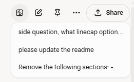

# Stream: Grok Prompt Navigator (Browser Extension)

## Overview
Stream is a Manifest V3 browser extension designed to enhance the user experience on grok.com's chat and project pages (`https://grok.com/chat/*` and `https://grok.com/project/*`). It injects a content script that adds a "My Prompts" button to the UI. Clicking this button displays a dropdown list of previews for the user's previous messages in the conversation. Selecting a preview smoothly scrolls to the corresponding message. The extension is built using vanilla JavaScript for DOM manipulation, event handling, and dynamic UI updates, with no external library dependencies.

<p align="center">
  
</p>

## Features
- **My Prompts Button**: Adds a button to the grok.com chat and project pages for quick access to user message previews.
- **Dropdown List**: Displays a scrollable dropdown with previews of user messages, limited to 5 words per preview for brevity.
- **Smooth Scrolling**: Clicking a preview scrolls smoothly to the corresponding message in the conversation.
- **Dynamic UI Handling**: Uses a `MutationObserver` to ensure the button persists across dynamic UI updates.
- **Lightweight Design**: No background scripts, external resources, or additional permissions required.

## Content Script Logic (`content.js`)
The core functionality is implemented in `content.js`, which is injected into matching pages. Key components include:

### 1. Utility Functions
- **`getPreview(text, wordCount = 10)`**:
  - Cleans input text by replacing multiple spaces with single spaces and trimming.
  - Returns "[Empty message]" for empty text.
  - Splits text into words and returns the first `wordCount` words (default: 10, customized to 5 for previews), appending "..." if truncated.

### 2. Dropdown Creation and Management
- Creates a `<div>` element for the dropdown with ID `prompt-list-dropdown`.
- **Styles**: Absolute positioning, hidden by default, with classes for z-index, rounded corners, background, border, text color, padding, shadow, max height (80vh), overflow auto, and minimum width.
- Appends the dropdown to `document.body`.
- **Event Listeners**:
  - Dropdown click: Stops propagation to prevent closing.
  - Document click: Closes the dropdown if the click is outside.
- **`toggleDropdown(button)`**:
  - Toggles dropdown visibility.
  - Queries user messages using the selector `.flex.flex-col.items-end .message-bubble` (targets right-aligned user message bubbles).
  - Clears dropdown content and populates with preview items:
    - Each item is a `<div>` with classes for cursor, padding, rounding, text size, and hover/focus effects.
    - Text content: Preview generated via `getPreview(msg.textContent, 5)`.
    - Click listener: Scrolls to the message using `scrollIntoView({ behavior: 'smooth' })` and hides the dropdown.
  - Positions the dropdown below the button using `getBoundingClientRect()` for coordinates, adjusted for scroll.

### 3. Button Addition
- **`addPromptListButton()`**:
  - Checks if the URL starts with `/chat/` or `/project/`; hides the button otherwise.
  - Targets the button container: `.absolute.flex.flex-row.items-center.gap-0.5.ms-auto.end-3`.
  - If the container exists and no button is present:
    - Creates a `<button>` with ID `prompt-list-button`, text "My Prompts".
    - Adds classes for border, padding, rounding, text size, flex layout, margin, and hover/focus effects.
    - Sets `type="button"`, `opacity=1`, auto width, `height=40px`.
    - Inserts the button as the first child of the container.
    - Adds click listener to toggle the dropdown, stopping propagation.
  - If the button exists but should be shown, ensures display is unset.

### 4. Dynamic UI Handling
- Uses a `MutationObserver` to monitor `document.body` for `childList` and `subtree` changes.
- Callback: Calls `addPromptListButton()` to ensure the button is added even if the UI reloads or updates dynamically.
- Initial call to `addPromptListButton()` for immediate addition if the container is present.

### 5. Icon Configuration
The extension uses an SVG icon for the "My Prompts" button, defined as follows:

```html
<svg width="20" height="20" viewBox="0 0 24 24" fill="none" xmlns="http://www.w3.org/2000/svg" class="stroke-[2]" stroke-width="2">
  <path d="M21.5 13v4.2c0 1.68-1.26 3.255-2.94 3.57a4.83 4.83 90 01-.945.105h-10.5a3.78 3.78 90 01-3.78-3.57V6.825c0-1.68 1.365-3.255 3.045-3.57a5.46 5.46 90 01.84-.105h10.395a3.78 3.78 90 013.78 3.675zM12.984 6.008C8.411 6.818 5.443 10.887 11.844 12 19.772 12.939 15.66 17.367 11.168 18.122M12.003 15.379V14.544M12.003 9.813V8.939" stroke="currentColor" stroke-linecap="square"/>
</svg>
```

- **Stroke Linecap Options**:
  - `butt`: Stroke ends abruptly at the path's endpoints (default).
  - `round`: Stroke ends are rounded, extending slightly beyond the endpoint.
  - `square`: Stroke ends with a square cap, extending by half the stroke width (currently used).
  - The `stroke-linecap` attribute can be modified to `butt` or `round` to adjust the appearance of the stroke ends.

## Installation
1. Clone or download the repository.
2. Open your browser's extension management page (e.g., `chrome://extensions/` in Chrome).
3. Enable "Developer mode".
4. Click "Load unpacked" and select the folder containing the extension files (`manifest.json`, `content.js`, and icon files).
5. Navigate to `https://grok.com/chat/*` or `https://grok.com/project/*` to see the "My Prompts" button in action.

## Usage
- On grok.com chat or project pages, locate the "My Prompts" button in the UI.
- Click the button to open a dropdown showing previews of your previous messages (up to 5 words each).
- Click a preview to scroll smoothly to the corresponding message in the conversation.
- Click outside the dropdown to close it.

## Development Notes
- The extension avoids external libraries to keep it lightweight and maintainable.
- The SVG icon's `stroke-linecap` can be customized (`butt`, `round`, or `square`) to match the desired visual style.
- Although thorough test was performed on grok.com, future changes to the site's UI or structure may affect compatibility. No guarantee of continued functionality is provided.