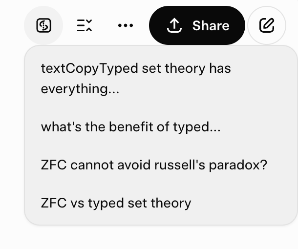

# Stream: Grok Prompt Navigator (Browser Extension)

## Overview
Stream is a Manifest V3 browser extension designed to enhance the user experience on grok.com's chat, conversation, and project pages (`https://grok.com/chat/*`, `https://grok.com/c/*`, and `https://grok.com/project/*`). It injects a content script that adds two buttons to the UI: a "My Prompts" button and a "Code Block Collapse" button. The "My Prompts" button displays a dropdown list of previews for the user's previous messages in the conversation, while the "Code Block Collapse" button collapses all expanded code blocks in the conversation with a single click. The extension is built using vanilla JavaScript for DOM manipulation, event handling, and dynamic UI updates, with no external library dependencies.

**Manifest Version:** 3

  

## Features

  

### 🎯 My Prompts Navigation
- **My Prompts Button**: Adds a button to the grok.com chat, conversation, and project pages for quick access to user message previews.
- **Smart Dropdown**: Displays a scrollable dropdown with previews of user messages, limited to 5 words per preview for brevity.
- **Smooth Navigation**: Clicking a preview scrolls smoothly to the corresponding message in the conversation.
- **Intuitive UI**: Click outside the dropdown to close it automatically.

### 📦 Code Block Management
- **Code Block Collapse Button**: Adds a button to collapse all code blocks in the conversation with a single click.
- **One-Click Operation**: Instantly collapse all expanded code blocks to reduce visual clutter.
- **Dynamic UI Handling**: Uses a `MutationObserver` to ensure buttons persist across dynamic UI updates and SPA navigation.

### ⚡ Performance & Compatibility
- **Lightweight Design**: No background scripts, external resources, or additional permissions required.
- **Vanilla JavaScript**: Built with pure JavaScript for maximum compatibility and minimal dependencies.
- **SPA Support**: Handles Single Page Application navigation seamlessly.
- **Cross-Browser**: Compatible with modern browsers supporting Manifest V3.

## Installation

### From Chrome Web Store (Recommended)
Download the extension directly from the Chrome Web Store:
[🔗 Stream: Grok Prompt Navigator](https://chromewebstore.google.com/detail/stream-grok-prompt-naviga/hcjnnokjhlaolaooijaeimhmbffhphnf)

### Manual Installation
1. Clone or download the repository.
2. Open your browser's extension management page (e.g., `chrome://extensions/` in Chrome).
3. Enable "Developer mode".
4. Click "Load unpacked" and select the folder containing the extension files (`manifest.json`, `content.js`, and icon files).
5. Navigate to `https://grok.com/chat/*` or `https://grok.com/c/*` or `https://grok.com/project/*` to see the "My Prompts" button in action.

## Usage
- On grok.com chat, conversation, or project pages, locate the "My Prompts" and "Code Block Collapse" buttons in the UI.
- **My Prompts Button**: Click to open a dropdown showing previews of your previous messages (up to 5 words each). Click a preview to scroll smoothly to the corresponding message in the conversation. Click outside the dropdown to close it.
- **Code Block Collapse Button**: Click to collapse all expanded code blocks in the conversation. The button displays a down-arrow icon and tooltip "Collapse code block" to indicate its function.

## Development Notes
- The extension avoids external libraries to keep it lightweight and maintainable.
- Although thorough test was performed on grok.com, future changes to the site's UI or structure may affect compatibility. No guarantee of continued functionality is provided.