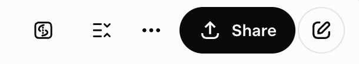
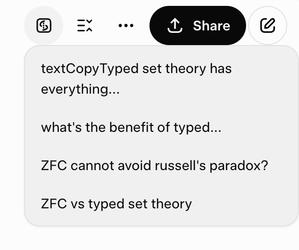

# Stream: Grok Prompt Navigator (Browser Extension)

## Overview
Stream is a Manifest V3 browser extension designed to enhance the user experience on grok.com's chat, conversation, and project pages (`https://grok.com/chat/*`, `https://grok.com/c/*`, and `https://grok.com/project/*`). It injects a content script that adds two buttons to the UI: a "My Prompts" button and a "Code Block Collapse" button. The "My Prompts" button displays a dropdown list of previews for the user's previous messages in the conversation, while the "Code Block Collapse" button collapses all expanded code blocks in the conversation with a single click. The extension is built using vanilla JavaScript for DOM manipulation, event handling, and dynamic UI updates, with no external library dependencies.

**Manifest Version:** 3

<p align="center">
  
</p>

## Features
<p align="center">
  
</p>

### 🎯 My Prompts Navigation
- **My Prompts Button**: Adds a button to the grok.com chat, conversation, and project pages for quick access to user message previews.
- **Smart Dropdown**: Displays a scrollable dropdown with previews of user messages, limited to 5 words per preview for brevity.
- **Answer Button**: Includes an "Answer" button for each preview to jump directly to the AI's response.
- **Smooth Navigation**: Clicking a preview scrolls smoothly to the corresponding message in the conversation.
- **Intuitive UI**: Click outside the dropdown to close it automatically.

### 📦 Code Block Management
- **Code Block Collapse Button**: Adds a button to collapse all code blocks in the conversation with a single click.
- **One-Click Operation**: Instantly collapse all expanded code blocks to reduce visual clutter.
- **Dynamic UI Handling**: Uses a `MutationObserver` to ensure buttons persist across dynamic UI updates and SPA navigation.

### ⚡ Performance & Compatibility
- **Lightweight Design**: No background scripts, external resources, or additional permissions required.
- **Vanilla JavaScript**: Built with pure JavaScript for maximum compatibility and minimal dependencies.
- **SPA Support**: Handles Single Page Application navigation seamlessly.
- **Cross-Browser**: Compatible with modern browsers supporting Manifest V3.
- **iOS Support**: Works well with Orion browser on iOS.

## Installation

### From Chrome Web Store (Recommended)
Download the extension directly from the Chrome Web Store:
[🔗 Stream: Grok Prompt Navigator](https://chromewebstore.google.com/detail/stream-grok-prompt-naviga/hcjnnokjhlaolaooijaeimhmbffhphnf)

### Manual Installation
1. Clone or download the repository.
2. Open your browser's extension management page (e.g., `chrome://extensions/` in Chrome).
3. Enable "Developer mode".
4. Click "Load unpacked" and select the folder containing the extension files (`manifest.json`, `content.js`, and icon files).
5. Navigate to `https://grok.com/chat/*` or `https://grok.com/c/*` or `https://grok.com/project/*` to see the "My Prompts" button in action.

## Usage
- On grok.com chat, conversation, or project pages, locate the "My Prompts" and "Code Block Collapse" buttons in the UI.
- **My Prompts Button**: Click to open a dropdown showing previews of your previous messages (up to 5 words each). Click a preview to scroll smoothly to the corresponding message in the conversation. Click outside the dropdown to close it.
- **Code Block Collapse Button**: Click to collapse all expanded code blocks in the conversation. The button displays a down-arrow icon and tooltip "Collapse code block" to indicate its function.

## Development Notes
- The extension avoids external libraries to keep it lightweight and maintainable.
- Although thorough test was performed on grok.com, future changes to the site's UI or structure may affect compatibility. No guarantee of continued functionality is provided.

## Chartjs prompt (For Grok)

This extension renders Chart.js charts inline whenever Grok responds with a `chartjs` code block. To get a chart, instruct Grok to output its data inside a fenced code block labeled `chartjs` (the label must be exactly `chartjs` — not `json` or `chart.js`). The extension auto-renders the chart inline and adds a **Raw** / **Render** toggle button so you can switch between the chart and the raw code.

A suggested prompt to give Grok:

<Rules>
- use chartjs code block to render the charts inline, format as below:

```chartjs
{
  "type": "chart_type_here",  // Required: The type of chart (e.g., "bar", "line", "pie").
  "data": {                   // Required: The data to plot.
    "labels": ["Label1", "Label2", ...],  // Array of strings for x-axis or category labels.
    "datasets": [               // Array of dataset objects.
      {
        "label": "Dataset Label",  // String: Name for this dataset (shows in legend).
        "data": [value1, value2, ...],  // Array of numbers: The values to plot.
        "backgroundColor": "color_here",  // Optional: Fill color (e.g., "rgba(75, 192, 192, 0.2)").
        "borderColor": "border_color_here",  // Optional: Line/border color.
        "borderWidth": number_here  // Optional: Border thickness (e.g., 1).
        // Additional dataset-specific options can be added here.
      }
      // More datasets can be added for multi-series charts.
    ]
  },
  "options": {                // Optional: Customization for scales, titles, etc.
    "scales": {
      "y": {                  // For y-axis (or x for horizontal charts).
        "beginAtZero": true,  // Boolean: Start scale at 0.
        "title": {
          "display": true,
          "text": "Axis Title"
        }
      }
      // Can include "x" scale similarly.
    },
    "responsive": true,       // Boolean: Make chart responsive to container size.
    // Other Chart.js options like plugins, animations, etc., can be added.
  }
}
```
